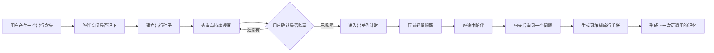

# FareSniper「记忆旅伴与旅行手帐」产品方案

## 1. 产品定义

这不是一个独立于 FareSniper 的新产品，而是“特价机票发现”现有记忆能力的体验升级。FareSniper 继续负责机票查询、完整成本比较、价格观察和提醒；宠物只把这些记忆和主动行为表达得更自然。

旅行手帐是用户确认购票并真实出行之后逐步形成的结果，不替代机票偏好、查询记录和价格关注这些核心记忆。

机票是关系的入口；长期记忆、主动提醒和旅行手帐才构成持续关系。

一句话定位：

> 一只记得你为什么出发、会在合适时间主动出现、最后替你整理旅行回忆的出行 Agent 旅伴。

## 2. 设计原则

1. **宠物是记忆的外在形象，不是独立的数据系统。** 更换宠物不会清空或改变用户记忆。
2. **人格只影响表达，不影响事实。** 所有宠物使用同一套价格、资格、排序和提醒规则。
3. **主动但不打扰。** 每次主动出现必须有真实触发原因，并遵守通知频率、安静时间和渠道设置。
4. **不虚构经历。** 用户说过、系统观察到、模型推断出的内容必须明确区分。
5. **记忆可见、可改、可忘。** 用户可以查看来源、纠正内容、设为私密或要求删除。
6. **旅行主线优先。** 第一期围绕“想去—观察—买票—出发—归来”，不扩张成泛旅行超级 App。

## 3. 宠物选择

首版提供三只宠物和一个无宠物模式。它们共享相同能力，只改变语气、动画和出现方式。

| 旅伴 | 性格 | 主动方式 | 示例表达 |
|---|---|---|---|
| 云朵猫 | 安静、柔和、观察型 | 少打扰，只在关键信号出现 | “我先替你记着，等它真的值得出发时再来找你。” |
| 登机柯基 | 热情、行动型 | 更愿意提出下一步建议 | “这条路线降到你的心理价位啦，要不要一起看看？” |
| 候鸟企鹅 | 冷静、有条理 | 强调时间、清单和确定信息 | “距离出发还有 72 小时，值机时间和行李规则已经整理好。” |
| 纯净助手 | 无拟人宠物 | 只展示必要信息 | “价格达到目标，查看本次变化。” |

用户可设置：

- 宠物种类与名字；
- 陪伴语气；
- 主动程度：安静、标准、积极；
- 安静时间和允许使用的通知渠道；
- 是否在手帐中保留宠物旁白。

宠物成长不与消费金额、连续签到绑定，而与真实旅程节点绑定，例如记录第一个想法、完成第一次价格观察、确认第一次出发、写下第一篇回忆。

## 4. 用户体验主线

### 阶段一：想法出现

用户说“秋天想去青岛吹吹海风”。系统识别为未来意图，但不会直接当成确定行程。

旅伴询问：

> 要不要把这个想法放进“想去的地方”？有合适的日期或价格时我再告诉你。

用户确认后建立 `TripSeed`。

### 阶段二：持续观察

用户多次搜索同一目的地、收藏航班或建立价格提醒后，旅伴可以总结变化，但不应仅因为一次浏览就推断长期偏好。

允许的主动行为：

- 达到目标价时提醒；
- 价格明显变化时解释变化；
- 多次搜索后询问是否正式持续关注；
- 将新的时间、行李和预算条件合并进当前旅程。

### 阶段三：确认购票

点击“前往预订”不等于已经买票。只有以下信号可以进入已购票状态：

- 用户明确回答“已经买了”；
- 用户手动录入订单信息；
- 用户主动上传或授权读取行程凭证（后续能力）。

### 阶段四：出发前

第一期只提供与航班强相关的确定性提醒：

- 价格或航班时间发生变化；
- 起飞倒计时；
- 值机时间；
- 行李规则与用户已记录约束；
- 用户自己创建的行前任务。

### 阶段五：旅行与归来

旅途中默认安静。归来后只提出一到两个轻问题，例如：

- “这次最喜欢的是什么？”
- “下次还愿意坐这么早的航班吗？”

用户回答后，系统生成手帐草稿。必须由用户确认，才能把感受转为长期记忆。

## 5. 五类记忆

| 类型 | 生命周期 | 内容 | 是否直接用于推荐 |
|---|---|---|---|
| 当前记忆 | 当前对话或当前旅程 | 本轮航线、日期、预算、待确认问题 | 是，短期使用 |
| 事实记忆 | 长期，直到用户修改 | 常用机场、行李要求、家庭出行等明确事实 | 是 |
| 经历记忆 | 按时间永久或由用户删除 | 某天的想法、搜索、选择、出发和回忆 | 间接使用 |
| 意图记忆 | 到期、完成或放弃 | “秋天想去青岛”“春节可能回家” | 用于主动观察 |
| 总结记忆 | 可衰减、可确认 | 从多次经历推断出的偏好与模式 | 仅在置信度足够且可解释时使用 |

每条记忆必须带有：

- 发生时间；
- 来源：用户明确表达、用户行为、外部事实、系统推断；
- 原始证据；
- 置信度；
- 所属旅程；
- 是否经过用户确认；
- 可见性和删除状态；
- 最后一次被使用的时间。

## 6. 数据对象建议

### CompanionProfile

保存宠物选择，不保存业务事实。

- `species`
- `name`
- `tone`
- `proactivity_level`
- `quiet_hours`
- `channels`
- `journal_voice_enabled`

### TripThread

串起一次从念头到归来的完整旅程。

- `id`
- `user_id`
- `title`
- `origin`
- `destination`
- `status`: `idea / watching / booked / upcoming / traveling / completed / archived`
- `depart_at / return_at`
- `created_at / completed_at`

### MemoryEvent

不可随意覆盖的原始经历记录。

- `event_type`
- `occurred_at`
- `trip_id`
- `content`
- `source`
- `evidence`
- `confidence`
- `confirmed_by_user`

### MemoryClaim

从事件中提炼出的事实、意图和总结，允许更新、衰减和撤销。

- `claim_type`: `fact / intention / reflection`
- `value`
- `evidence_event_ids`
- `confidence`
- `status`: `proposed / confirmed / rejected / expired`
- `valid_from / valid_until`

### JournalEntry

面向用户展示的手帐页。

- `entry_date`
- `trip_id`
- `title`
- `blocks`
- `pet_note`
- `source_event_ids`
- `user_edited_at`
- `published_at`

### CompanionTask

承载 Agent 的未来行动。

- `task_type`
- `trigger_at / trigger_rule`
- `trip_id`
- `channel`
- `status`
- `dedupe_key`
- `last_attempt_at`

## 7. 主动行为规则

| 触发 | 宠物行为 | 写入记忆 | 是否需要确认 |
|---|---|---|---|
| 用户表达未来想法 | 询问是否保存为出行种子 | 意图记忆 | 需要 |
| 同一目的地被反复搜索 | 询问是否持续观察 | 经历事件 + 候选总结 | 需要开启观察 |
| 报价命中目标 | 发送价格变化与推荐理由 | 经历事件 | 不需要，但受通知设置约束 |
| 用户确认已购票 | 进入倒计时，停止无意义价格提醒 | 事实事件 | 需要 |
| 距离出发 72/24 小时 | 提醒值机、时间与行李 | 任务执行记录 | 已授权提醒即可 |
| 预计旅行结束 | 询问一个回顾问题 | 经历事件 | 用户可忽略 |
| 月末或旅程完成 | 生成手帐草稿 | JournalEntry | 发布前需要 |

所有主动行为需要统一通过主动性策略判断：重要性、时效性、证据强度、最近通知次数、安静时间和用户选择的主动等级。

## 8. 手帐信息架构

手帐以时间为主，不再以“偏好、习惯、想法、历史”作为第一层目录。

建议结构：

1. 封面：用户、宠物、年度与已完成旅程数；
2. 月份书签：2026 年 7 月；
3. 旅程章节：青岛的秋天、春节回家；
4. 日期页：当天发生的真实事件；
5. 回忆页：用户确认后的总结；
6. 辅助筛选：想法、决定、出发、回忆、偏好。

单页示例：

> **2026 年 7 月 22 日**  
> 你说，秋天想去青岛吹吹海风。  
> 现在还没有确定日期，但你希望这是一趟不用赶行程的短假。  
> 旅伴已经把它放进“想去的地方”，暂时不会打扰你。

每页提供：`修改`、`记错了`、`设为私密`、`不要用于推荐`、`忘掉这件事`。

## 9. 关键页面

### 首次选择旅伴

- 先选择宠物，再给它起名；
- 展示语气和主动程度预览；
- 明确说明“更换宠物不会影响记忆”；
- 提供纯净助手模式。

### 聊天页

- 宠物保持轻量，不占用主要对话空间；
- 在保存想法、价格变化、出发倒计时等节点出现；
- 每次写入长期记忆时给出可撤销提示。

### 旅程页

- 展示进行中的 TripThread；
- 将航班查询、价格关注、购票确认和提醒放在同一时间线；
- 明确区分“还在想”“持续观察”“已经购买”。

### 记忆手帐

- 默认打开最近月份；
- 以真实事件生成日期页；
- 展示来源与用户确认状态；
- 支持编辑、删除和隐私控制。

## 10. MVP 范围

### 必须完成

1. 宠物选择、命名、主动程度与纯净模式；
2. TripThread 生命周期；
3. MemoryEvent、MemoryClaim 和 JournalEntry；
4. 将真实搜索、价格提醒、购票确认写入旅程；
5. 三类主动行为：价格命中、行前提醒、归来回顾；
6. 可编辑的日期手帐；
7. 来源、确认、修改、删除和隐私控制；
8. 关键记忆与主动行为的自动化评测。

### 暂不进入第一期

- 酒店、景点和完整攻略生成；
- 自动读取所有照片和聊天记录；
- 未经用户确认推断已经购票；
- 高频养成任务、签到和消费驱动成长；
- 多人共享宠物和多人旅行协作；
- Hermes、飞书和微信的完整开放接入。

后续可以把查询、比较、记忆和提醒开放为 Skill/API，供 Hermes + Cron 调用，并通过飞书、微信等渠道交付。

## 11. 验收标准

- 用户能选择、更换和关闭宠物，且记忆不丢失；
- 用户一句话可以建立待确认的出行种子；
- 同一旅程的搜索、关注、购票和提醒能够串联；
- 系统不会把点击预订误判成购票；
- 所有推断记忆都能展示证据并被用户否定；
- 手帐内容完全来自真实事件或用户确认，不生成虚构经历；
- 主动提醒遵守安静时间、频率和渠道设置；
- 用户删除记忆后，不再被检索和用于推荐；
- 更换宠物只改变表达方式，不改变价格、排序和推荐结论。

## 12. 推荐实施顺序

1. 先落数据结构和记忆写入规则；
2. 再建立 TripThread 与主动任务；
3. 接入聊天、搜索、价格提醒和购票确认事件；
4. 实现真实手帐 API；
5. 最后实现宠物选择、动画与个性化表达；
6. 通过评测后逐步开放外部渠道和 Hermes 接入。
