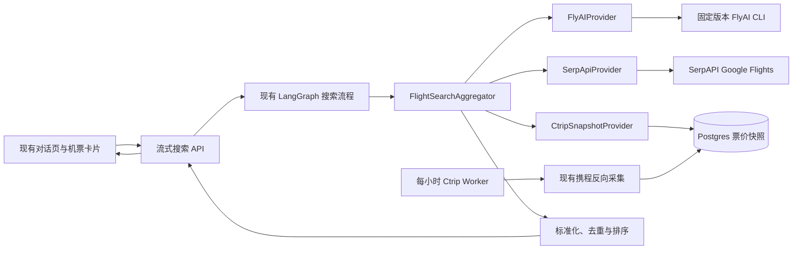

# FareSniper 多平台实时机票数据接入设计

**日期：** 2026-07-16

**状态：** 已确认

**范围：** 仅机票；酒店搜索、酒店预订和 RollingGo 不在本期范围内

## 1. 背景与目标

FareSniper 当前已经具备自然语言搜索、航班推荐卡片、价格历史、预订深链和 LangSmith 基础能力，但在线搜索仍主要依赖本地快照、VariFlight 航班数据及 Mock 回退，无法稳定提供用户需要的多平台实时票价。

本期接入三个数据渠道：

- 飞猪 FlyAI：国内和国际航线的实时搜索及飞猪 `jumpUrl`。
- 携程：复用仓库已有反向采集能力，通过每小时后台 Worker 生成票价快照。
- Google Flights：通过 SerpAPI 获取国际航线结果，展示响应中的实际承运方或销售平台。

目标是在不重做现有前端卡片的前提下，实现渐进式多来源查询：先返回先展示，尚未完成的来源显示“正在获取数据”，单一平台失败不影响整个搜索。

“接入三个渠道”表示系统会调用所有适用于当前航线且已配置的渠道，不表示第三方平台保证每次都有库存或价格。生产环境不得用 Mock 数据伪装成实时结果。

## 2. 非目标

- 不接入酒店搜索、酒店详情、酒店下单或 RollingGo。
- 不在 FareSniper 内完成机票支付或订单创建，只提供外部预订跳转。
- 不反向破解 FlyAI CLI 内部协议，不使用包内默认凭据或未公开签名材料。
- 不在本期接入飞猪推广者 `appKey`、`appSecret` 或佣金归因；FlyAI 返回的 `jumpUrl` 按原样使用。推广凭据签发后再通过独立 Affiliate Link Provider 接入。
- 不把 VariFlight 当作票价来源；现有 VariFlight 仅保留用于航班时刻、状态和基础信息补充。
- 不保证不同平台返回的是同一个舱位、行李规则或退改规则；未知字段不得填充虚构默认值。

## 3. 已确认的产品行为

### 3.1 搜索与展示

- 保留现有 `DiscoveryCardContent` 视觉结构和对话搜索入口。
- 国内航线展示“飞猪”和“携程”来源。
- 国际航线展示 SerpAPI 响应中的实际承运方或销售平台名称；内部仍记录数据渠道为 `serpapi_google_flights`。
- 用户发起搜索后立即显示来源加载状态。平台结果到达时，原地更新卡片，不要求用户重新搜索。
- 每个实时 Provider 最多等待 10 秒。超时的平台不阻塞其他平台。
- FlyAI 没有返回价格但存在 `jumpUrl` 时，保留飞猪来源行，显示“查看实时价”，不将其纳入最低价排序。
- 携程快照超过 75 分钟时标记“价格可能已更新”，可以作为参考展示，但不参与“实时最低价”结论。

### 3.2 输入约束

- 出发日期必须是未来日期。过去日期在调用外部 Provider 前直接返回可操作的校验提示。
- 城市输入先通过现有机场/城市映射归一化为中文全称；FlyAI 只接收归一化后的中文城市名称。
- 城市存在歧义或无法映射时，沿用现有补槽流程向用户澄清，不向 Provider 猜测提交。
- 国际搜索请求 SerpAPI 时优先指定人民币币种；若结果不是人民币，则保留原币种，不在缺少可靠汇率来源时自行换算。

## 4. 总体架构



### 4.1 Provider 边界

所有来源实现统一的 `FlightProvider` 协议。协议负责接收标准化查询并返回标准化 Offer，不允许前端、LangGraph 节点或推荐模型直接理解某个平台的原始响应。

Provider 的逻辑职责如下：

- 判断自身是否适用于当前航线。
- 执行一次有边界的搜索或快照读取。
- 将第三方字段转换为标准 Offer。
- 返回可区分的成功、空结果、过期、超时、禁用和错误状态。
- 保留排错所需的受控元数据，但不向业务层泄露密钥、Cookie 或完整原始响应。

### 4.2 Provider 实现

#### FlyAIProvider

- 在 Railway 构建阶段安装并固定 FlyAI CLI 版本，不在请求时运行 `npx` 下载依赖。
- 通过 `asyncio.create_subprocess_exec` 调用本地可执行文件，不使用 shell 拼接命令。
- 只从环境变量读取 `FLYAI_API_KEY`；仓库内仅保留空占位。
- 对 CLI 的退出码、标准输出和标准错误分别处理，并对日志脱敏。
- 解析有价格结果和仅含 `jumpUrl` 的结果。后者可跳转，但不参加数值排序。

#### SerpApiProvider

- 使用现有异步 HTTP 客户端模式直接调用 SerpAPI Google Flights API。
- 主要用于国际航线；国内航线默认不调用，避免增加延迟和费用。
- 数据渠道字段固定为 `serpapi_google_flights`，用户可见来源取响应中的承运方或销售平台名称。
- 保留可用的预订链接、航班号、时间、价格、币种和行李信息；缺失字段保持未知。

#### CtripSnapshotProvider

- 在线 FastAPI 进程只读取数据库快照，不直接启动 Selenium 或 Chromium。
- 查询匹配的航线和日期，返回最新有效快照；没有快照时登记采集需求。
- 快照在 75 分钟内为 `success`，超过 75 分钟为 `stale`。
- 过期结果可以展示为参考，但不得被标记为实时最低价。

## 5. 航线调度规则

| 航线类型 | FlyAI | SerpAPI | 携程快照 | VariFlight |
| --- | --- | --- | --- | --- |
| 中国大陆国内 | 实时查询 | 默认不调用 | 读取最新快照 | 时刻/状态补充 |
| 国际及港澳台 | 实时查询 | 实时查询 | 有匹配快照时读取 | 时刻/状态补充 |

`FlightSearchAggregator` 并发启动所有适用且已配置的 Provider。缺少环境变量的 Provider 返回 `disabled`，而不是抛出导致整次请求失败的异常。

## 6. 渐进式数据流

### 6.1 API 兼容策略

- 保留现有 `POST /api/search`，继续返回一次性 `ChatSearchResponse`，供旧客户端和现有测试使用。
- 新增 `POST /api/search/stream`，使用 `fetch` 可消费的 NDJSON 流。选择 NDJSON 而不是浏览器 `EventSource`，因为当前搜索需要 POST JSON 和 Authorization Header。
- 两个入口调用同一套 LangGraph、聚合器和标准化逻辑。普通入口等待最终快照；流式入口在中间状态变化时发送事件。

### 6.2 事件协议

流式接口只发送以下事件：

- `started`：包含 `search_id`、`session_id` 和预计调用的 Provider。
- `provider_status`：包含 Provider、状态和可展示的简短说明。
- `results`：包含当前完整的排序结果快照和各来源状态。前端用最新快照替换当前卡片数据，避免复杂增量合并。
- `validation_error`：输入不完整、日期无效或城市无法确认；发送后结束。
- `complete`：包含最终状态、成功来源、失败来源和总耗时。

事件必须带 `search_id` 和单调递增的 `sequence`。前端忽略旧搜索或乱序事件，避免用户连续提交查询时旧结果覆盖新结果。

### 6.3 查询步骤

1. 复用现有意图识别和槽位补全，得到出发城市、到达城市和出发日期。
2. 确定性校验日期和城市，并判断国内/国际航线。
3. 返回 `started`，将所有适用来源置为 `loading`。
4. 并发调用实时 Provider，并读取携程快照。
5. 任一来源返回后执行标准化、去重和重排，再发送新的 `results` 快照。
6. 实时来源达到 10 秒后结束等待，未完成项标记 `timeout`。
7. 推荐与 Value Judge 使用最终可用结果运行；没有数值价格的 Offer 不进入最低价判断。
8. 发送 `complete` 并关闭流。客户端断开时取消仍在运行且可安全取消的任务。

## 7. 标准数据模型与卡片映射

### 7.1 标准 Offer

每条标准 Offer 至少包含：

- `data_provider`：`flyai`、`ctrip_snapshot` 或 `serpapi_google_flights`。
- `seller_name`：用户可见的平台、承运方或销售方名称。
- `flight_no`、出发/到达机场、出发/到达时间。
- `depart_date`、舱位和币种。
- `base_price`、`tax`、`baggage_fee` 和 `total_price`，均允许未知。
- `price_status`：`priced`、`view_live_price` 或 `stale`。
- `booking_url`：FlyAI 的 `jumpUrl`、携程深链或 SerpAPI 返回的预订链接。
- `fetched_at`、`expires_at` 和 `is_realtime`。

价格组成不完整时，前端显示“待确认”，不得把未知税费或行李费当作 0。只有 Provider 明确返回免费行李时才显示“免费”。

### 7.2 去重和排序

- 同一航班优先用航班号、日期、出发时间和机场组合去重。
- 同一行程的多个销售 Offer 保留在平台价格列表中。
- 数值价格按可比较的总价排序；无法得到总价时按 Provider 明确提供的展示价排序，并标注价格口径。
- `view_live_price` 和 `stale` Offer 不参与“实时最低价”徽标竞争。
- 排名相同时再使用现有推荐分、行李、直飞和时间偏好排序。

### 7.3 现有卡片

本期不重做卡片布局。`DiscoveryCardContent` 的价格列表扩展为可表达以下状态：

- 飞猪：`¥580` 或“查看实时价”。
- 携程：`¥610`、“正在获取数据”或“价格可能已更新”。
- 国际销售平台：例如“Singapore Airlines ¥2,860”或“Trip.com ¥2,940”。

当前聊天页仍优先展示排名第一的推荐卡片，后端继续返回完整的 `deals` 数组。平台价格列表表示同一航线和日期下各来源的最低可见报价；若并非同一航班，界面不得用“同航班价差”描述它们。

首个可展示 Offer 到达前继续使用现有搜索加载气泡；首个 Offer 到达后显示原卡片，并在价格列表中保留其他来源的加载状态。流结束时不得留下无限旋转状态：尚未完成的实时来源显示“暂时超时”，已登记但尚未采集的携程来源显示“等待下次刷新”。

## 8. 携程每小时 Worker

### 8.1 调度

- Railway 独立 Worker 每小时整点运行一次。
- Worker 启动时获取数据库租约；上一轮仍在运行时，本轮直接退出并记录 `skipped_overlap`，禁止两个浏览器采集批次重叠。
- 任务优先级依次为：已启用价格监控的航线、最近用户搜索且无有效快照的航线、预设热门航线。
- 搜索请求遇到快照缺失时只写入采集需求，不在 API 进程内启动浏览器。
- 已过出发日期的任务自动停用；普通搜索需求在最后一次请求 7 天后过期，价格监控任务按监控生命周期保留。
- 浏览器采集采用保守并发，并保留随机间隔和失败退避，降低触发平台限制的概率。
- 同一 Provider、航线、日期和采集小时使用幂等键，重复执行不得写入重复快照。

### 8.2 数据保存

至少需要两类持久化记录：

- `flight_search_demands`：航线、日期、优先级、来源、最后请求时间和下次可采集时间。
- `flight_price_snapshots`：Provider、航线、日期、标准化 Offer、抓取时间、过期时间和受控原始引用。

Worker 失败不得删除上一份成功快照。连续失败时保留旧数据并标为 `stale`，同时在 LangSmith 和应用日志中记录失败原因。

## 9. 状态与异常处理

Provider 状态统一为：

- `loading`：正在实时获取。
- `queued`：已登记到携程下一轮采集任务。
- `success`：返回有效且仍在有效期内的数据。
- `empty`：平台正常响应但没有结果。
- `stale`：只有过期快照。
- `timeout`：超过 10 秒。
- `disabled`：缺少配置或功能开关关闭。
- `error`：鉴权、限流、解析或上游异常。

处理规则：

- 只有所有适用且已启用的来源均失败时，才显示整体搜索失败。
- 没有任何已启用来源时显示“机票数据源尚未配置”，不得伪装成无票或网络失败。
- 有任一来源成功时展示已有卡片，并在平台列表中说明其他来源的状态。
- 所有来源均正常但无结果时显示“当前日期/航线暂无可售结果”，不得显示网络错误。
- `401` 不重试，标记配置错误并告警。
- `429`、连接重置和临时 `5xx` 最多重试一次，使用短暂抖动退避。
- 连续失败的实时 Provider 启用短期熔断；熔断期间返回 `error` 或 `disabled` 状态，不拖慢搜索。
- 第三方响应解析失败时保存结构摘要和响应 ID，不将完整响应或凭据写入日志。

## 10. LangSmith Trace 设计

每次在线搜索创建根 Trace `flight_search`，包含以下子 Span：

- `validate_and_normalize_input`
- `provider.flyai`
- `provider.ctrip_snapshot`
- `provider.serpapi`
- `normalize_and_deduplicate`
- `rank_results`
- `stream_results`

每小时携程任务创建独立根 Trace `ctrip_hourly_refresh`，每个采集任务作为子 Span。

可记录字段包括：匿名化搜索 ID、航线类型、Provider、耗时、状态、结果数量、缓存年龄、重试次数、HTTP 状态类别和 CLI 退出码。不得记录 API Key、Cookie、完整 Authorization Header、完整推广参数、用户 PII 或未脱敏的原始第三方响应。

关键观测指标包括 Provider 成功率、空结果率、P50/P95 延迟、10 秒超时率、携程快照年龄、Worker 每小时处理数量及流式搜索首个结果耗时。

## 11. 配置与安全

仓库的 `.env.example` 只保留空值：

```dotenv
FLYAI_API_KEY=
SERPAPI_API_KEY=
LANGSMITH_TRACING=true
LANGSMITH_ENDPOINT=https://api.smith.langchain.com
LANGSMITH_API_KEY=
LANGSMITH_PROJECT=faresniper
```

实际密钥只配置在 Railway 服务变量中。日志、异常、测试快照、LangSmith 输入输出和 Git 历史均不得包含密钥。

FlyAI 查询参数通过参数数组传给子进程，不经过 shell。预订链接仅允许 `https`，打开时继续使用 `noopener noreferrer`。第三方 URL 不在服务端自动访问，避免把返回链接变成 SSRF 入口。

## 12. Railway 部署拓扑

- `frontend`：现有 Next.js 服务，改用流式 API 并保留普通 API 兼容路径。
- `backend`：现有 FastAPI 服务；构建镜像增加固定 Node.js 运行时和固定版本 FlyAI CLI。
- `ctrip-worker`：使用同一后端代码和 Chromium 依赖，按小时调度采集命令，不对公网暴露端口。
- `postgres`：复用现有数据库，新增采集需求和快照持久化。

`backend` 配置 FlyAI、SerpAPI 和 LangSmith 变量；`ctrip-worker` 配置数据库和 LangSmith 变量。缺少某个 Provider 的密钥只禁用该来源，不影响服务启动。

## 13. 测试策略

### 13.1 单元测试

- 未来日期、过去日期、中文城市归一化和歧义城市。
- FlyAI CLI 的成功、空结果、无价格、有/无 `jumpUrl`、非零退出码、超时和 401。
- SerpAPI 的国际销售平台名称、币种、价格、预订链接、429 和异常响应。
- 携程快照的 75 分钟边界、过期、缺失和 Worker 失败保留旧快照。
- 标准化、同航班去重、未知税费/行李费、缺价 Offer 和实时最低价规则。
- Provider 超时、一次重试、熔断以及取消清理。

### 13.2 集成与契约测试

- 使用固定响应样本测试三个 Provider，不在默认测试套件调用真实第三方服务。
- 验证 NDJSON 的 `started`、状态、结果和 `complete` 顺序及 `sequence` 单调递增。
- 验证 `/api/search` 与 `/api/search/stream` 最终结果一致。
- 验证一个 Provider 失败、超时或禁用时其他 Provider 仍能完成。
- 验证 LangSmith Span 名称、父子关系和脱敏逻辑。

### 13.3 前端测试

- 搜索开始后显示各来源“正在获取数据”。
- 新结果到达时原地更新现有卡片。
- 国内显示飞猪/携程，国际显示实际承运方或销售平台。
- 无价格 FlyAI 行显示“查看实时价”并使用 `jumpUrl`。
- 携程过期数据显示提示且不获得实时最低价徽标。
- 连续搜索时旧事件不覆盖新搜索；组件卸载或取消时关闭流。

### 13.4 上线冒烟测试

真实调用测试由显式命令执行，测试未来日期和中文城市，不进入默认 CI。上线后分别验证一条国内航线和一条国际航线，并在 LangSmith 中确认根 Trace 与 Provider 子 Span。

## 14. 验收标准

- 国内搜索能够看到飞猪和携程来源状态，并渐进更新现有卡片。
- 国际搜索能够调用 FlyAI 和 SerpAPI，卡片显示实际承运方或销售平台名称。
- FlyAI 无价格时仍提供可用 `jumpUrl`，且不会产生虚构最低价。
- 携程 Worker 每小时运行一次，成功写入快照；失败时保留上一份快照。
- 任一来源失败、超时或缺少配置时，其他来源仍可正常返回。
- 所有来源均为空时显示无库存语义，而不是网络错误。
- LangSmith 能看到在线搜索和携程 Worker Trace，且不包含密钥和敏感凭据。
- Railway 生产环境不存在 Mock 票价回退。

## 15. 实施顺序

1. 建立标准 Provider 协议、Offer 模型和状态模型，并完成纯单元测试。
2. 接入 FlyAI 和 SerpAPI Provider，替换生产 Mock 回退。
3. 增加流式聚合接口和现有卡片的渐进状态更新。
4. 增加携程采集需求、快照存储和每小时 Railway Worker。
5. 补齐 LangSmith 子 Span、告警、真实冒烟验证和 Railway 配置文档。

详细文件级任务、测试命令和提交拆分将在本设计批准后的实施计划中给出。
