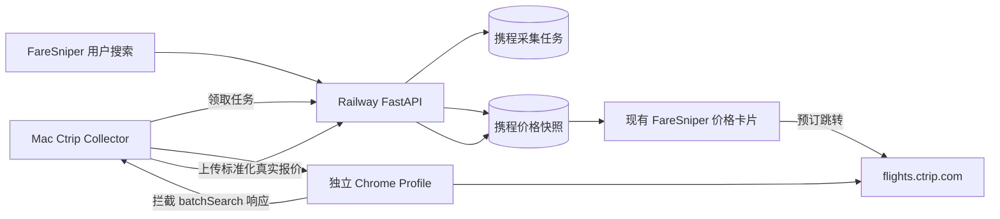

# FareSniper 国内携程 Mac 采集节点设计

**日期：** 2026-07-18

**状态：** 待书面规格确认

**范围：** 国内携程机票价格采集、Railway 快照接入和现有价格卡片展示

## 1. 背景与目标

FareSniper 需要在现有价格卡片中展示国内携程真实机票价格。Trip.com Affiliate 仅提供国际站推广链接和跨域搜索组件，不能向 FareSniper 返回国内携程结构化报价，因此不作为本需求的数据源。

仓库已有基于 Selenium 的携程航班页访问、`batchSearch` 响应拦截和价格解析代码，但当前存在以下问题：

- 本地 Python 环境未安装 Selenium 时，导入异常被静默吞掉，搜索直接返回空列表。
- Railway 海外运行环境不适合长期运行依赖登录态和国内网络质量的携程浏览器采集。
- 每次复制临时 Chrome Profile，登录态和验证码恢复不可靠。
- 归一化结果会虚构其他平台价格、固定税费和免费行李，不能作为真实票价展示。
- AI 自由文本和前端卡片分别消费同一次搜索的不同表达：卡片读取最终 `deals[0]`，而 `render_response` 会用 ReAct 模型最后一段未校验文本覆盖确定性推荐文案，导致 AI 表格、最低价和卡片价格可能不一致。

本期目标是把用户长期在线的 Mac 作为国内携程采集节点，Railway 只负责分发任务、接收真实数据和向 FareSniper 提供快照。采集节点每小时刷新关注航线，并优先处理用户最近搜索和价格监控产生的需求。

## 2. 已确认的产品行为

- FareSniper 现有价格卡片展示携程页面实际返回的数值价格。
- 携程价格超过新鲜期后仍可展示并参与最低价判断，但必须标记“价格可能已更新”。
- 卡片不显示“上次采集”字样；可以显示简洁的更新时间或价格状态。
- 携程价格点击后跳转国内携程航班搜索页，以预订页的最终库存、税费和行李规则为准。
- 采集失败时保留上一份成功快照，不用空结果覆盖真实历史数据。
- 不展示虚构的去哪儿、飞猪或同程对比价。
- 不把未知税费、行李费用或免费行李填成固定默认值。
- Mac 使用 Clash Verge 时，采集专用 Chrome 直连携程，不影响用户日常浏览器继续使用代理。
- AI 回复中的航班号、时间、价格、最低价和预算结论必须与同一响应返回的最终 `deals` 完全一致。

## 3. 非目标

- 不接入 Trip.com 国际站价格或 Affiliate 搜索框作为国内携程数据源。
- 不破解携程加密协议、不绕过验证码、不伪造设备证明或使用未公开签名材料。
- 不在 Railway API 请求进程中启动 Selenium、Chrome 或其他浏览器。
- 不在 FareSniper 内完成支付、出票、退改签或订单管理。
- 不保证携程页面每次都返回库存；登录失效、验证码、限流和页面升级必须作为可见状态处理。
- 不抓取所有城市和所有未来日期，只处理有产品价值的任务队列。

## 4. 总体架构



系统分为三个明确边界：

1. **Mac Collector** 只负责浏览器会话、任务执行、携程响应解析和结果上传。
2. **Railway Collector API** 只负责任务租约、上传鉴权、数据校验和幂等保存。
3. **Ctrip Snapshot Provider** 只负责读取已保存快照并转换成现有搜索结果，不理解 Selenium 或携程原始响应。

## 5. Mac Collector

### 5.1 持久化浏览器会话

采集节点使用专用 Chrome Profile，例如 `~/.faresniper/ctrip-profile`，不复制用户默认 Chrome Profile。首次初始化以有头模式打开携程，由用户手动完成登录和可能出现的验证码。后续定时任务复用同一 Profile。

采集进程不得读取、上传或记录携程密码。Railway 不接收携程 Cookie、Local Storage、浏览器 Profile 或账号信息。

### 5.2 网络与 Clash Verge

采集专用 Chrome 使用 `--no-proxy-server`，并为 ChromeDriver 本地通信设置 `NO_PROXY=127.0.0.1,localhost`。因此采集浏览器直接访问携程，用户平时使用的 Chrome 和 Clash Verge 配置保持不变。

启动诊断需要记录访问出口和携程页面状态，但日志不得包含 Cookie、授权头或完整原始响应。

### 5.3 调度方式

macOS 使用 `launchd` 管理采集进程：

- 开机登录后自动启动。
- 每分钟向 Railway 领取可执行任务。
- 每小时由 Railway 为价格监控、近期搜索和热门航线生成刷新任务。
- 同一 Mac 同时最多运行一个 Chrome 采集任务，避免浏览器会话冲突和过高请求频率。
- Mac 睡眠或离线期间任务保留在 Railway；恢复后继续领取，任务租约过期可重新分配。

### 5.4 采集步骤

1. 使用任务中的标准城市代码和未来日期构建国内携程单程搜索 URL。
2. 打开页面并等待 `batchSearch` 请求完成。
3. 捕获页面自身收到的响应，只解析目标航线和日期。
4. 提取航班号、承运方、起降时间、机场、页面展示价格和可确认的舱位字段。
5. 构建国内携程搜索跳转 URL。
6. 向 Railway 上传标准化报价和受控诊断元数据。
7. 成功后确认任务；失败时上报结构化错误并按策略退避。

采集器不得根据历史经验补齐税费、行李费或其他平台价格。响应中未明确提供的字段保持未知。

## 6. Railway 任务与上传协议

### 6.1 鉴权

Railway 和 Mac 共享独立环境变量 `CTRIP_COLLECTOR_TOKEN`。内部 Collector API 使用 Bearer Token 鉴权，并通过 HTTPS 传输。该 Token 与用户登录、携程账号和 LangSmith Key 分离。

Token 不提交到 Git，不返回给前端，不写入日志。无效 Token 返回 `401`，不透露任务是否存在。

### 6.2 内部接口

内部接口保持最小化：

- `POST /internal/collector/claim`：领取一项到期任务并建立限时租约。
- `POST /internal/collector/jobs/{job_id}/complete`：上传标准化报价并完成任务。
- `POST /internal/collector/jobs/{job_id}/fail`：上报登录、验证码、超时、空结果或解析错误。
- `POST /internal/collector/heartbeat`：上报节点版本、健康状态和最后成功时间。

领取接口一次只返回一项任务。完成和失败接口要求任务租约属于当前节点，防止过期任务覆盖新结果。

### 6.3 幂等与数据校验

任务幂等键由 `provider + origin + destination + depart_date + refresh_window` 组成。同一小时的重复任务合并。

上传时校验：

- Provider 必须是 `ctrip_snapshot`。
- 日期必须是任务指定的未来日期。
- 城市代码必须与任务一致。
- 价格必须为正整数，币种固定为响应确认的 `CNY`。
- 预订链接只能是允许的携程 HTTPS 域名。
- 航班号、时间和价格不得使用 Mock 默认值。

上传只保存标准化字段和有限诊断摘要，不保存完整第三方响应。

## 7. 数据模型与保留策略

### 7.1 采集任务

任务至少包含：

- 航线、出发日期和优先级。
- 来源类型：价格监控、近期搜索或热门航线。
- 状态、尝试次数、下一次执行时间和租约信息。
- 最近错误类别和最后成功时间。

优先级依次为价格监控、近期用户搜索、热门航线。过期出发日期不再生成任务。

### 7.2 价格快照

快照至少包含：

- `data_provider=ctrip_snapshot`。
- 航班、航线、日期、时间和承运方。
- 携程页面展示价格及币种。
- `fetched_at`、`expires_at` 和 `price_status`。
- 国内携程预订跳转 URL。

默认新鲜期为 75 分钟，与每小时调度保留 15 分钟容错。超过新鲜期后状态变为 `stale`，但记录继续保留并可参与平台展示价排序。新一轮空结果或失败不得删除上一份成功快照。

## 8. 搜索与卡片展示

### 8.1 在线读取

用户搜索时，Railway 不等待 Mac 启动浏览器：

1. 立即读取匹配航线和日期的最新携程快照。
2. 存在快照时返回价格卡片；过期数据附带 `stale` 状态。
3. 快照缺失或过期时登记高优先级采集任务。
4. 没有快照时显示“正在获取携程数据”，而不是网络失败或虚构价格。

### 8.2 价格口径

携程 `batchSearch` 返回的有效经济舱页面展示价作为 `display_price`。只有响应明确提供完整总价组成时，才拆分票价、税费和行李费；否则这些字段保持未知。

为了满足已确认需求，过期携程展示价参与最低价判断，但界面结论改为“平台展示价最低”，不得宣称为实时全网综合总价。卡片同时显示“价格可能已更新，以预订页为准”。

### 8.3 现有卡片适配

现有 `DiscoveryCardContent` 保持整体布局，但数据模型需要支持：

- 可空税费和行李费。
- `priced`、`stale`、`loading`、`login_required`、`captcha_required`、`error` 状态。
- 携程实际价格和国内携程跳转链接。
- 明确区分“页面展示价”和“综合总价”。

删除真实携程归一化中的以下虚构内容：

- 携程价格加固定差值生成的去哪儿、飞猪和同程价格。
- 固定 `tax=120`。
- 默认 `baggage_fee=0` 和 `has_baggage=true`。
- 没有来源依据的折扣、原价、置信度和购买结论。

### 8.4 AI 回复与卡片一致性

最终排序后的 `deals` 是用户可见航班事实的唯一来源。以下内容必须从同一份不可变的最终快照生成：

- 前端价格卡片及其平台价格列表。
- AI 回复中的航班表格、航班号、起降时间和价格。
- “最低价”、是否超出预算、推荐航班和价格提醒建议。
- 写入聊天历史的 assistant 文本。

后端新增确定性的事实渲染步骤：

1. Provider 聚合、标准化和排序完成后冻结最终 `deals`。
2. 从 `deals` 构建 `response_facts`，包含最多指定数量的航班行、首选航班、最低展示价、预算和价格状态。
3. 航班 Markdown 表格、最低价句子和预算比较由服务端模板生成，不交给 LLM 计算或抄写。
4. LLM 只允许生成不包含航班号、时间和金额的解释性文字；该文字作为可选段落拼接，不能覆盖事实段落。
5. 输出前执行一致性校验：回复中出现的航班号和人民币金额必须来自 `response_facts`。校验失败时丢弃 LLM 段落并使用纯确定性回复。

`render_response` 不再在存在 `deals` 时使用 `_last_ai_text` 覆盖 `recommendation.text`。没有搜索结果的闲聊、补槽和普通问答仍可使用最后一条 AI 文本。

前端继续同时消费同一 API 响应中的 `recommendation.text` 和 `deals[0]`，不在浏览器端重新计算另一套最低价。这样即使 LLM 暂时不可用，卡片和文案仍保持一致。

## 9. 状态与恢复

Collector 使用以下结构化状态：

- `online`：节点正常领取任务。
- `collecting`：正在执行携程采集。
- `offline`：心跳超时。
- `login_required`：携程会话失效，需要用户在专用 Chrome 登录。
- `captcha_required`：页面出现验证码，需要用户手动处理。
- `empty`：携程正常响应但目标航线无结果。
- `timeout`：页面或 `batchSearch` 超时。
- `parse_error`：收到响应但结构无法解析。
- `dependency_error`：Selenium、Chrome 或 ChromeDriver 不可用。

依赖导入和浏览器启动错误不得继续返回普通空列表。Collector 将错误上报 Railway；Railway 保留旧价格并在管理日志和 LangSmith 中记录状态。

验证码和登录失效不自动绕过。节点切换到需要人工处理状态，打开或保留有头 Chrome；用户处理完成后恢复任务。

## 10. LangSmith 与日志

Railway 为任务分发、结果接收和快照读取创建 Trace：

- `ctrip_collector_claim`
- `ctrip_collector_ingest`
- `provider.ctrip_snapshot`

Mac Collector 为每个任务创建独立 Trace `ctrip_local_collect`，记录任务匿名 ID、航线类型、耗时、结果数量和错误类别。不得记录 Collector Token、携程 Cookie、账号信息、完整 URL 查询参数或完整响应正文。

关键指标包括节点最后心跳、每小时成功任务数、空结果率、登录/验证码状态、采集 P95 耗时、快照年龄和解析错误率。

## 11. 配置与部署

Railway Backend 新增：

```dotenv
CTRIP_COLLECTOR_TOKEN=
CTRIP_SNAPSHOT_TTL_MINUTES=75
CTRIP_COLLECTOR_HEARTBEAT_TIMEOUT_SECONDS=180
```

Mac 本地配置存放在仓库外且权限限制为仅当前用户可读：

```dotenv
FARESNIPER_API_BASE_URL=https://<backend-domain>
CTRIP_COLLECTOR_TOKEN=
CTRIP_CHROME_PROFILE_DIR=~/.faresniper/ctrip-profile
LANGSMITH_TRACING=true
LANGSMITH_PROJECT=faresniper
```

Mac 安装脚本负责创建虚拟环境、安装固定版本依赖、验证 Chrome、生成 `launchd` 配置并执行首次有头登录检查。卸载脚本只移除定时任务，不删除 Profile，除非用户明确要求。

## 12. 测试策略

### 12.1 单元测试

- 缺少 Selenium 时返回 `dependency_error`，不返回普通空结果。
- 携程响应解析只保留真实字段，不生成其他平台价格。
- 未知税费和行李字段保持空值。
- Token 鉴权、任务租约、幂等完成和过期租约拒绝。
- 新鲜与过期快照的读取、排序和状态映射。
- 失败或空结果不覆盖上一份成功快照。
- 当 LLM 文本包含与 `deals` 不一致的价格或航班号时，事实校验拒绝该文本并回退确定性回复。
- 确定性航班表格、最低价、预算结论和 `deals[0]` 使用同一份最终排序结果。
- 没有 `deals` 的闲聊和补槽响应仍保留正常 AI 文本。

### 12.2 集成测试

- 使用固定脱敏 `batchSearch` 样本完成解析、上传、数据库读取和卡片 DTO 映射。
- 模拟节点离线、登录失效、验证码、超时和解析结构变化。
- 验证用户搜索会创建需求但不会在 Railway API 进程启动浏览器。
- 验证过期携程价格参与“平台展示价最低”判断并带过期提示。
- 验证一次 API 响应中的推荐文案、航班表格、价格卡片和聊天历史不存在价格分叉。

### 12.3 本地真实验证

真实测试仅由显式命令执行，不进入 CI：

1. 使用未来日期和国内城市代码搜索一条常见航线。
2. 确认专用 Profile 已登录且采集 Chrome 直连。
3. 对比采集价格、航班号和时间与可见携程页面。
4. 上传 Railway 后，从 FareSniper 搜索同一航线。
5. 确认卡片价格、过期状态、预订链接和 LangSmith Trace。

## 13. 验收标准

- Mac 重启并登录后，Collector 能由 `launchd` 自动恢复。
- Clash Verge 开启时，采集专用 Chrome 仍能直连国内携程。
- 至少一条未来国内航线能够采集真实携程价格并上传 Railway。
- FareSniper 价格卡片显示采集到的携程数值价格，不包含虚构平台、税费或行李字段。
- 过期价格仍参与平台展示价排序，并显示“价格可能已更新”。
- 携程采集失败时保留上一次成功价格，且错误原因可在日志和 LangSmith 中识别。
- 登录或验证码失效时不会伪装成无票，用户可以在 Mac 上人工恢复。
- Railway API 服务不安装或启动 Chrome，Mac Collector 不向 Railway 上传携程登录凭据。
- 对任意包含航班卡片的搜索响应，AI 表格最低价、预算判断和卡片价格均来自相同的最终 `deals`；LLM 不能引入响应中不存在的金额或航班。

## 14. 实施顺序

1. 修复携程依赖与错误模型，删除真实结果中的虚构字段。
2. 建立 Railway 任务、租约、快照和 Collector 内部 API。
3. 建立 Mac Collector CLI、持久 Profile、心跳和安全上传。
4. 增加 `launchd` 安装与首次登录流程。
5. 接入 Ctrip Snapshot Provider 和可空价格字段。
6. 建立基于最终 `deals` 的确定性事实渲染和 AI 文本一致性校验。
7. 调整现有卡片状态、平台展示价排序和携程跳转。
8. 补充 LangSmith、集成测试和真实国内航线验证。
